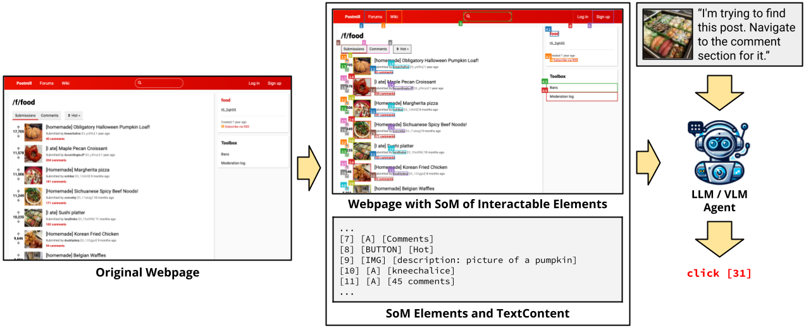

<h1 align="center">
    Running ICAL in VisualWebArena
</h1>

### Contents
<div class="toc">
<ul>
<li><a href="#install"></a>Installation</li>
<li><a href="#dataset"> Dataset </a></li>
<li><a href="#running-full-pipeline-with-GT-perception"> Running Pipeline </a></li>
<li><a href="#citation"> Citation </a></li>
</ul>
</div>

## Install
```bash
# Python 3.10+
python -m venv venv
source venv/bin/activate
pip install -r requirements.txt
playwright install
pip install -e .
```

You can also run the unit tests to ensure that VisualWebArena is installed correctly:
```
pytest -x
```

## End-to-end Evaluation
1. Setup the standalone environments.
Please check out [this page](environment_docker/README.md) for details.

2. Configurate the urls for each website.
```bash
export CLASSIFIEDS="<your_classifieds_domain>:9980"
export CLASSIFIEDS_RESET_TOKEN="4b61655535e7ed388f0d40a93600254c"  # Default reset token for classifieds site, change if you edited its docker-compose.yml
export SHOPPING="<your_shopping_site_domain>:7770"
export REDDIT="<your_reddit_domain>:9999"
export WIKIPEDIA="<your_wikipedia_domain>:8888"
export HOMEPAGE="<your_homepage_domain>:4399"
```

3. Generate config files for each test example:
```bash
python scripts/generate_test_data.py
```
You will see `*.json` files generated in the [config_files](./config_files) folder. Each file contains the configuration for one test example.

4. Obtain and save the auto-login cookies for all websites:
```
bash prepare.sh
```

5. Set up API keys.

If using OpenAI models, set a valid OpenAI API key (starting with `sk-`) as the environment variable:
```
export OPENAI_API_KEY=your_key
```

## Running with ICAL examples


If using Gemini, first install the [gcloud CLI](https://cloud.google.com/sdk/docs/install). Configure the API key by authenticating with Google Cloud:
```
gcloud auth login
gcloud config set project <your_project_name>
```

6. Launch the evaluation. For example, to reproduce our GPT-3.5 captioning baseline:
```bash
python run.py \
  --instruction_path agent/prompts/jsons/p_cot_id_actree_3s.json \
  --test_start_idx 0 \
  --test_end_idx 1 \
  --result_dir <your_result_dir> \
  --test_config_base_dir=config_files/test_classifieds \
  --model gpt-3.5-turbo-1106 \
  --observation_type accessibility_tree_with_captioner
```
This script will run the first Classifieds example with the GPT-3.5 caption-augmented agent. The trajectory will be saved in `<your_result_dir>/0.html`. Note that the baselines that include a captioning model run on GPU by default (e.g., BLIP-2-T5XL as the captioning model will take up approximately 12GB of GPU VRAM).

## GPT-4V + SoM Agent


To run the GPT-4V + SoM agent we proposed in our paper, you can run evaluation with the following flags:
```bash
python run.py \
  --instruction_path agent/prompts/jsons/p_som_cot_id_actree_3s.json \
  --test_start_idx 0 \
  --test_end_idx 1 \
  --result_dir <your_result_dir> \
  --test_config_base_dir=config_files/test_classifieds \
  --model gpt-4-vision-preview \
  --action_set_tag som  --observation_type image_som
```

To run Gemini models, you can change the provider, model, and the max_obs_length (as Gemini uses characters instead of tokens for inputs):
```bash
python run.py \
  --instruction_path agent/prompts/jsons/p_som_cot_id_actree_3s.json \
  --test_start_idx 0 \
  --test_end_idx 1 \
  --max_steps 1 \
  --result_dir <your_result_dir> \
  --test_config_base_dir=config_files/test_classifieds \
  --provider google  --model gemini --mode completion  --max_obs_length 15360 \
  --action_set_tag som  --observation_type image_som
```

## Citation
If you find our environment or our models useful, please consider citing ICAL as well as VisualWebArena:
```
@article{sarch2024ical,
  title={},
  author={},
  journal={},
  year={2024}
}
@article{koh2024visualwebarena,
  title={VisualWebArena: Evaluating Multimodal Agents on Realistic Visual Web Tasks},
  author={Koh, Jing Yu and Lo, Robert and Jang, Lawrence and Duvvur, Vikram and Lim, Ming Chong and Huang, Po-Yu and Neubig, Graham and Zhou, Shuyan and Salakhutdinov, Ruslan and Fried, Daniel},
  journal={arXiv preprint arXiv:2401.13649},
  year={2024}
}
```

## Acknowledgements

This code builds on [VisualWebArena](https://github.com/web-arena-x/visualwebarena). Be sure to check them out!
